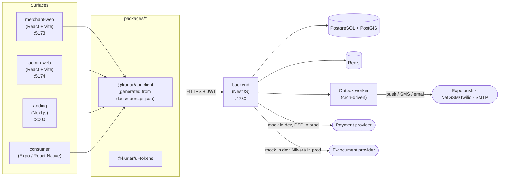

# Kurtar

Kurtar is a Turkish end-of-day surplus-food marketplace, in the style of Too Good To Go: participating bakeries, cafés, restaurants, patisseries and greengrocers ("fırın", "kafe", "restoran", "pastane", "manav") publish a limited number of "surprise bags" of unsold food at a fixed discounted price each evening. Consumers discover nearby bags, reserve and pay in the app, then pick them up in person during a short pickup window with an in-app swipe (no merchant hardware required). The platform earns a small fixed fee per bag plus an annual merchant membership, settles each merchant's earnings on a 5-Turkish-business-day cycle (with a 1% withholding tax deduction), and issues e-documents for both.

## Architecture



Every write path funnels through the backend's typed REST API (`/api/...`); no surface talks to Postgres/Redis directly. `packages/api-client` is generated from the committed OpenAPI contract (`docs/openapi.json`) so all four surfaces share one source of truth for request/response shapes — see [`docs/frontend-contract.md`](docs/frontend-contract.md) for the client's usage contract and [`docs/architecture/decisions/`](docs/architecture/decisions/) for the design decisions behind the backend (outbox pattern, PostGIS, settlement ledger, etc).

## Prerequisites

- Node.js 20+ (see `.nvmrc`) and npm 10+
- Docker + Docker Compose v2 (`docker compose version` should print `v2.x`)
- Nothing else — every external integration (SMS, payment, push, e-document) defaults to an in-process mock in development; see `.env.example`.

**Platform.** The bring-up script is `bash`, so it runs as written on Linux and
macOS. On **Windows 11 use WSL2** — which Docker Desktop already requires, so a
machine that meets the prerequisites above has it. Clone and run *inside* the
WSL filesystem, not under `/mnt/c`: see
[`docs/windows-11.md`](docs/windows-11.md) for the whole path, including the
port proxy a phone needs to reach the API. There is no PowerShell entry point
and adding one that drifts from the bash version would be worse than not having
it.

`ops/docker-compose.yml` pins `postgis/postgis:16-3.4`, which the upstream
project publishes for amd64 only — every tag, not just this one. On Apple
Silicon Docker runs it under emulation, which works and is slower on first
start while `initdb` runs.

## One-command bring-up

```bash
./scripts/dev-up.sh
```

When it finishes, check it actually came up:

```bash
curl http://localhost:4750/api/health/ready
# {"status":"ready","database":"up"}
```

Use `/api/health/ready`, not `/api/health`. The latter is a liveness probe
and deliberately answers `ok` even when the database is unreachable — which
is right for an orchestrator and useless as a "did my setup work?" check.

This single command, from a clean clone, does everything:

1. creates `.env`/`landing/.env.local` from their `.env.example` files if missing (dev-safe defaults, mock providers — never use these values in production);
2. starts PostGIS + Redis (`docker compose -f ops/docker-compose.yml up -d --wait`);
3. installs dependencies (`npm ci`) if `node_modules` is missing;
4. generates the Prisma client and **applies every pending migration** (`prisma migrate deploy`) — this step is never optional and never skippable, because an unapplied migration on a merged tree is a real, reachable way to turn the backend suite red (a schema-changing migration landed on this branch the same day it was merged — see `20260815210000_reservation_consumer_redeem` — so a dev DB that predates that merge would be exactly one `prisma migrate deploy` away from matching the code again);
5. seeds the reversible demo dataset (`npm run seed:demo -w backend` — see below; pass `--no-seed` to skip);
6. starts the backend and the three web surfaces concurrently, with prefixed, interleaved logs.

Press Ctrl+C to stop every server it started (the infra containers keep running — `./scripts/dev-up.sh --down` stops those too, without touching the seeded data in the volume).

Each surface then runs at:

| Surface | URL | Notes |
|---|---|---|
| Backend API | http://localhost:4750/api | Health check: `GET /api/health` |
| merchant-web | http://localhost:5173 | Merchant panel — onboarding, today's offers, pickup list, earnings |
| admin-web | http://localhost:5174 | Admin panel — merchant approvals, complaints, moderation, finance |
| landing | http://localhost:3000 | Public marketing site + merchant signup funnel |
| consumer (Expo) | run separately | `npm run web -w consumer` (or `npm run ios`/`android` with a simulator) — not started by `dev-up.sh`, see below |

The Expo consumer app isn't part of the one-command bring-up because it has no meaningful "just serve it" mode outside its own device/simulator tooling. Once the backend is up, run:

```bash
npm run web -w consumer      # browser preview at http://localhost:8081
# or
npm run ios -w consumer      # requires Xcode / iOS Simulator
npm run android -w consumer  # requires Android Studio / an emulator
```

To run it on a **real phone** — which is the only way to judge touch targets,
safe-area insets and native type scaling — see
[`docs/consumer-on-a-phone.md`](docs/consumer-on-a-phone.md). Read its first
section before you decide the app is empty: the seeded surprise bags open at
19:00 and close at 21:00 Istanbul time, so at any other hour every shop is
correctly shut, and there is a build flag that pins the clock so you can see
the evening without waiting for it.


### Prove it from scratch

To convince yourself this genuinely works from nothing (not just "works on this machine"):

```bash
docker compose -f ops/docker-compose.yml down -v   # destroy the dev DB volume entirely
./scripts/dev-up.sh                                 # migrations + seed + all four servers, from zero
```

## Demo credentials

**These are demo-only accounts, seeded by `backend/prisma/seed-demo.ts` (`npm run seed:demo -w backend`, already run by `dev-up.sh`). Never use this password anywhere real.**

All demo accounts share the password **`KurtarDemo123!`**.

| Role | Login | Notes |
|---|---|---|
| Admin | `demo.admin@kurtar.app` | admin-web |
| Merchant (APPROVED) | `hakan@modafirin.demo.kurtar.app` | Moda Fırın, Kadıköy |
| Merchant (APPROVED) | `sibel@yeldegirmenipastanesi.demo.kurtar.app` | Yeldeğirmeni Pastanesi, Kadıköy — has a **SETTLED** settlement batch |
| Merchant (APPROVED) | `onur@caferagakahve.demo.kurtar.app` | Caferağa Kahve Evi, Kadıköy — has a **CALCULATED** (pending admin approval) batch |
| Merchant (APPROVED) | `murat@leventfirin.demo.kurtar.app` | Levent Fırın, Beşiktaş — has a live, redeemable offer right after seeding |
| Merchant (DRAFT) | `pelin@nisantasikahve.demo.kurtar.app` | Nişantaşı Kahve Durağı — never submitted for review, so it has no store/offer yet |
| Merchant (SUSPENDED) | `tolga@mecidiyekoyocakbasi.demo.kurtar.app` | Mecidiyeköy Ocakbaşı, Şişli — kill-switch demo case |
| Consumer | phone `+905551110002` (Elif Demir) | has a **CONFIRMED** reservation in a live pickup window right after seeding — open the redeem screen to see it |

Every other seeded merchant/consumer is listed in `backend/prisma/seed-demo.ts`'s own doc comment. Consumer accounts sign in via phone-OTP; the mock SMS provider never sends a real SMS — the 6-digit code is logged to the backend's own console (`kurtar dogrulama kodunuz: XXXXXX`), never echoed in the HTTP response (a deliberate anti-account-takeover choice — see `backend/src/modules/otp/otp.service.ts`).

The seed is **idempotent and reversible**: re-running `npm run seed:demo -w backend` tears down and recreates the exact same dataset (never duplicates rows); `npm run seed:demo:down -w backend` removes every row it created and touches nothing else (never an operator's real merchants/consumers/settlements). The teardown reaches rows by fixed `kd-demo-*` ids **and** by what they point at — a reservation made by *using* the demo gets a generated cuid, so a prefix-only delete left it behind and the offer delete then failed on its foreign key, i.e. the seed was reversible only until somebody used it. Scope in the other direction is pinned by `src/modules/seed/seed-demo-teardown.realdb.spec.ts`.

The demo bags are **day-scoped**: they land on today's Istanbul date with a 19:00–21:00 pickup window, so a seed from an earlier day leaves discovery correctly empty. Re-seed before a review run, and see [`docs/consumer-on-a-phone.md`](docs/consumer-on-a-phone.md) for pinning the clock to that day.

## Running tests

| Workspace | Command | What it covers |
|---|---|---|
| Backend | `cd backend && npx jest --runInBand` | 107 suites / 914 tests — unit + real-Postgres/PostGIS integration specs |
| merchant-web | `npm run test:run -w apps/merchant-web` | Vitest + Testing Library |
| admin-web | `npm run test -w apps/admin-web` | Vitest + Testing Library |
| landing | `npm run test -w landing` | Vitest |
| consumer | `npm run test -w consumer` | Jest + React Native Testing Library (the Expo app has no browser E2E surface — see below) |
| Cross-surface E2E | see [`docs/operations.md`](docs/operations.md#end-to-end-test) | Playwright, against the real backend + built merchant-web/admin-web — proves the whole money loop |

Backend tests need `TEST_DATABASE_URL`/`DATABASE_URL`/`REDIS_URL` pointed at the dev stack (`ops/docker-compose.yml`'s ports — see `.env.example`); a plain `npm test -w backend` also works once those are exported.

## Regenerating the API contract

The backend is the single source of truth. After changing a controller/DTO:

```bash
cd backend
npm run openapi:generate          # regenerates docs/openapi.json from the live route/DTO metadata
npm run openapi:check-response-types  # fails loud if any operation lost its typed 2xx response

cd ..
npm run generate:api-client       # regenerates packages/api-client/src/generated/openapi-types.ts from docs/openapi.json
npm run build -w @kurtar/api-client  # rebuilds dist/ — every app resolves the package through its "main": "dist/index.js", not the TS source
```

**`npm install` builds the shared packages for you.** Both `@kurtar/ui-tokens`
and `@kurtar/api-client` resolve through their compiled `dist/`, which is
gitignored — so on a fresh clone they do not exist, and before this was wired
up `npm test` failed in 40 of the consumer's 63 suites with
`Cannot find module '@kurtar/api-client'`, which reads like a broken checkout
rather than a missing build step. Each package now has a `prepare` script, so
npm builds them at install time and the obvious command works from a clean
clone. Verified by cloning into a fresh directory and running it.

That last build step is easy to skip and still "look" done — the generate step alone updates the TS source, but merchant-web/admin-web/landing/consumer all import the package via its published `dist/` output (`packages/api-client/package.json`'s `"main"`), so a stale, unrebuilt `dist/` silently keeps serving the OLD contract to every frontend even after `generate:api-client` succeeded. (`@kurtar/ui-tokens` has the exact same `dist/`-is-what-gets-imported shape, though it's rarely hand-edited the way the contract is regenerated.)

Both regeneration steps (`openapi:generate` + `generate:api-client`) are enforced as CI drift gates (`.github/workflows/quality-gates.yml`'s `openapi-contract-drift` and `frontend-quality` jobs) — a controller change that forgets to regenerate fails the build, not silently ships a stale contract to four frontends. `frontend-quality` also always rebuilds `dist/` itself before linting/typechecking any frontend, which is why CI can never be fooled by a stale local `dist/` the way a local dev loop can.

## Repository layout

```
backend/            NestJS API — the single source of truth for the data model and business rules
apps/
  merchant-web/      Merchant panel (React + Vite)
  admin-web/         Admin panel (React + Vite)
  consumer/          Consumer app (Expo / React Native)
packages/
  api-client/        @kurtar/api-client — generated + hand-written typed HTTP client, shared by all four surfaces
  ui-tokens/         @kurtar/ui-tokens — shared design tokens (web + React Native)
landing/             Public marketing site + merchant signup funnel (Next.js)
e2e/                 Cross-surface Playwright test (the money loop, end to end)
ops/                 docker-compose files (dev / staging / prod) + deploy topology
scripts/             dev-up.sh, db-migration-doctor.sh, backup-database.sh
docs/
  openapi.json               committed API contract
  frontend-contract.md       how the four surfaces use @kurtar/api-client
  operations.md              deploy / migrations / backups / crons / incident runbook
  launch-checklist.md        everything that must be true before real money flows
  architecture/decisions/    ADRs for decisions a future engineer would otherwise re-litigate
```

## Further reading

- [`docs/operations.md`](docs/operations.md) — the operator's runbook: deploying, the migration doctor, backups, the cron inventory, reading a settlement batch, responding to a failed payout or an SLA alert, and the merchant kill-switch.
- [`docs/launch-checklist.md`](docs/launch-checklist.md) — what must be true before this handles real money, and who owns each item.
- [`docs/architecture/decisions/`](docs/architecture/decisions/) — ADRs.
- [`docs/frontend-contract.md`](docs/frontend-contract.md) — the contract every frontend surface builds against.
